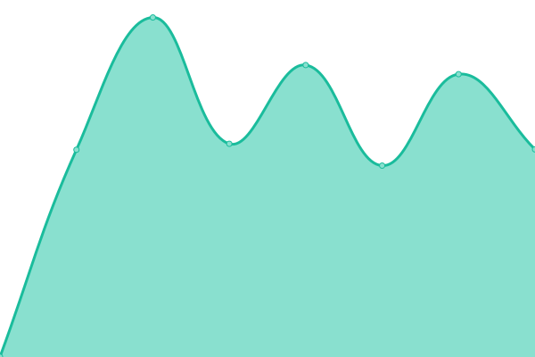
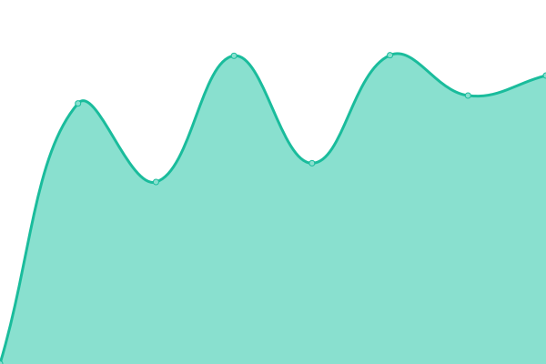

# [📈 Live Status](https://dimitrilongo.github.io/uptime): <!--live status--> **🟧 Partial outage**

This repository contains the open-source uptime monitor and status page for [Dimitri Longo](https://elanathemes.fr), powered by [Upptime](https://github.com/upptime/upptime).

With [Upptime](https://upptime.js.org), you can get your own unlimited and free uptime monitor and status page, powered entirely by a GitHub repository. We use [Issues](https://github.com/dimitrilongo/uptime/issues) as incident reports, [Actions](https://github.com/dimitrilongo/uptime/actions) as uptime monitors, and [Pages](https://dimitrilongo.github.io/uptime) for the status page.

<!--start: status pages-->
<!-- This summary is generated by Upptime (https://github.com/upptime/upptime) -->
<!-- Do not edit this manually, your changes will be overwritten -->
<!-- prettier-ignore -->
| URL | Status | History | Response Time | Uptime |
| --- | ------ | ------- | ------------- | ------ |
|  [Lexolia](https://www.lexolia.com) | 🟥 Down | [lexolia.yml](https://github.com/dimitrilongo/uptime/commits/HEAD/history/lexolia.yml) | 

 1363ms
     
 | 

<a href="https://status.lexolia.com/history/lexolia">32.25%</a>
    

|  [Lexolia APP](https://app.lexolia.com) | 🟥 Down | [lexolia-app.yml](https://github.com/dimitrilongo/uptime/commits/HEAD/history/lexolia-app.yml) | 

 459ms
     
 | 

<a href="https://status.lexolia.com/history/lexolia-app">0.00%</a>
    

|  [Lexolia CRM](https://crm.lexolia.com) | 🟩 Up | [lexolia-crm.yml](https://github.com/dimitrilongo/uptime/commits/HEAD/history/lexolia-crm.yml) | 

 913ms
     
 | 

<a href="https://status.lexolia.com/history/lexolia-crm">100.00%</a>
    

<!--end: status pages-->

[**Visit our status website →**](https://dimitrilongo.github.io/uptime)

## 📄 License

- Powered by: [Upptime](https://github.com/upptime/upptime)
- Code: [MIT](./LICENSE) © [Anand Chowdhary](https://anandchowdhary.com), supported by [Pabio](https://pabio.com)
- Data in the `./history` directory: [Open Database License](https://opendatacommons.org/licenses/odbl/1-0/)
